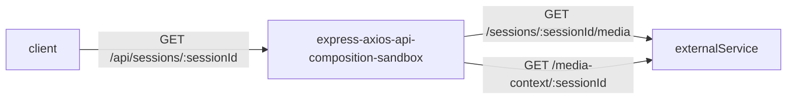

# express-axios-api-composition-sandbox
An express app with internal request emulation using nock + API composition and axios retry logic.


## Architecture



### Installation
```sh
npm install
npm run build
docker compose up
open http://localhost:3000/api/sessions/90d61876-b99a-443e-994c-ba882c8558b6
```

### Development
```sh
npm install
npm start
```

### Testing
#### Unit
```sh
npm run test:unit
```

#### Functional
You need to have app running
```sh
npm test:functional
```

### Specification

The acceptance criteria for the required feature would be to create a RESTful GET endpoint that returns the session
and media with combined details relevant to the consumer of the API.

The structure of the RESTful GET endpoint would be defined by you, but it should meet the following criteria:

✅ Fix the media context in the response using `/sessions/:sessionId/media` and `/media-context/:sessionId` endpoints to have only relevant and corrected media as a result

✅ Group media by the context type

✅ Irrelevant media must be filtered out

✅ Media list must be sorted by probability descending

✅ Implement at least one test, which must pass on every run

